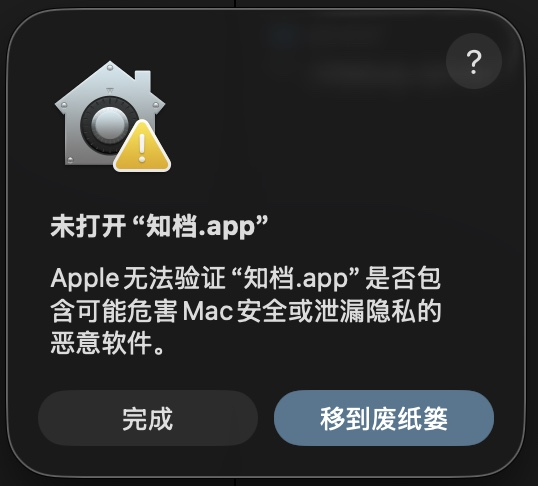
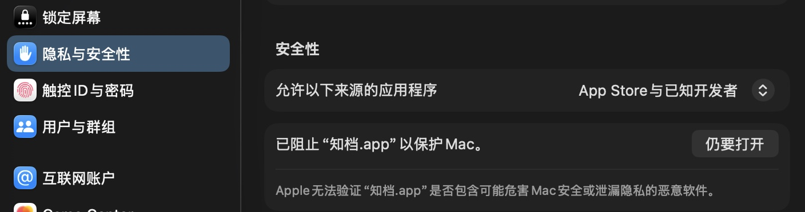
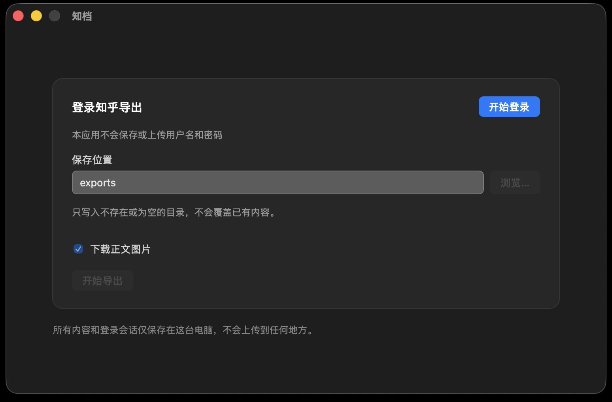
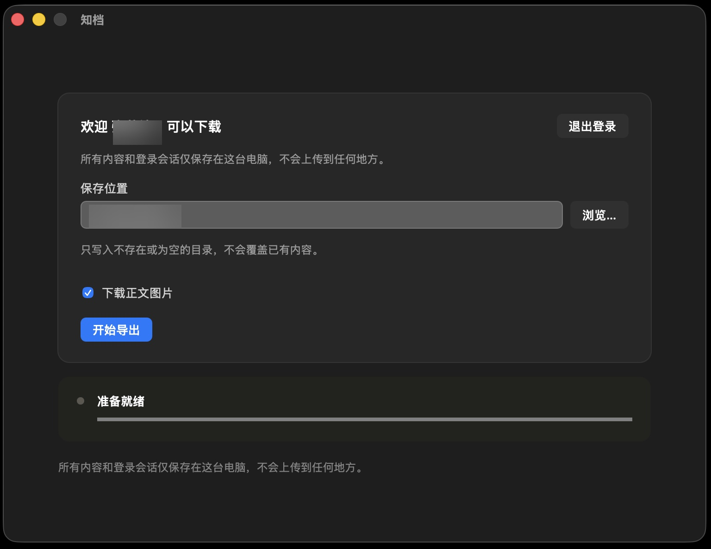
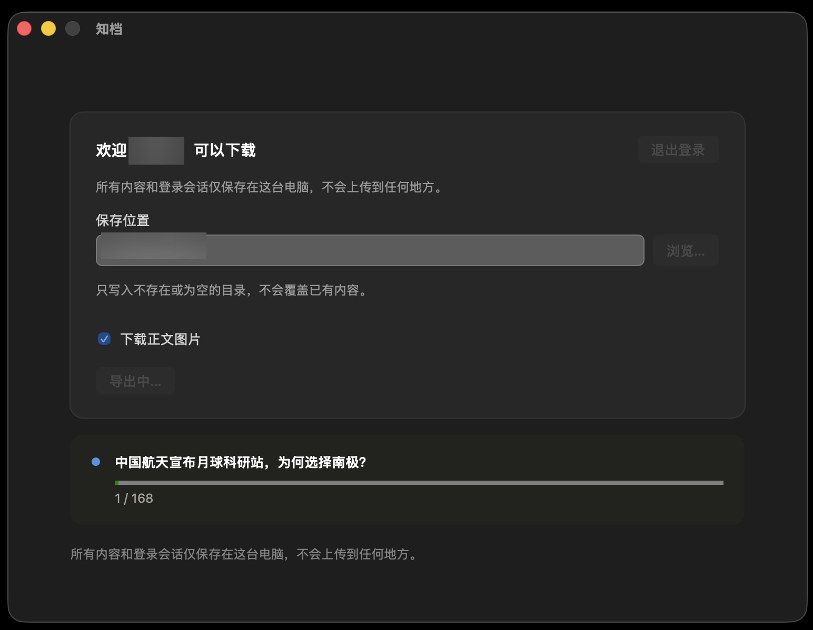
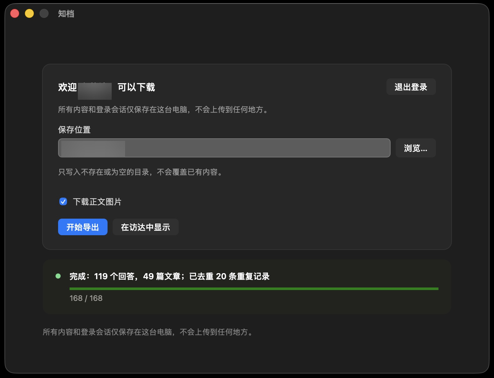
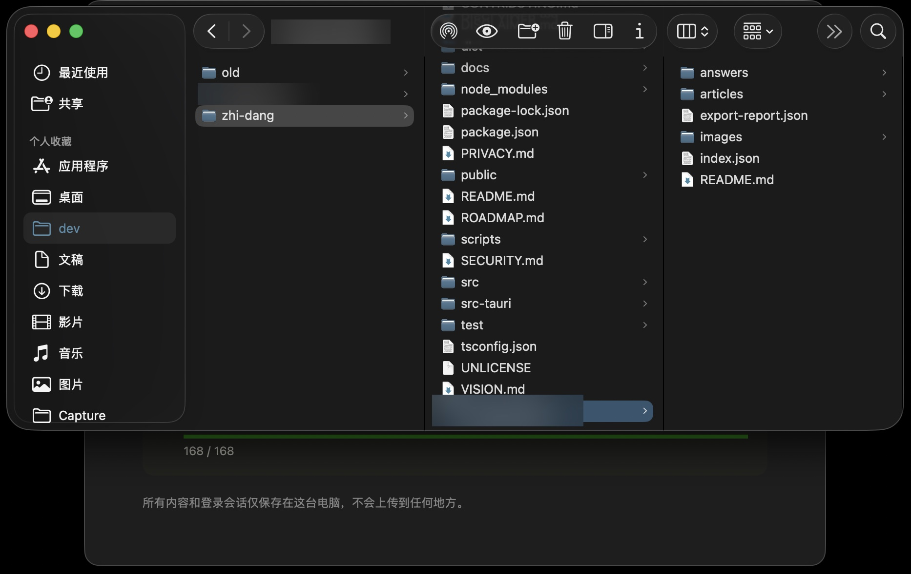

# 使用教程

这份教程按实际操作顺序，用截图说明从下载到导出完成的完整流程。

## 1. 下载和安装

从 [GitHub Releases](https://github.com/zhangyingfeng/zhi-dang/releases) 页面下载最新版本的安装包。当前只提供 macOS（Apple Silicon）版本，安装包是一个 `.dmg` 文件。

下载后双击打开 `.dmg`，把"知档"拖进"应用程序"文件夹，再从"应用程序"或启动台打开。

## 2. 首次打开

第一次打开时，因为应用尚未完成 Apple 开发者签名，macOS 会先提示"无法验证开发者"：

点"完成"关掉这个提示，然后打开"系统设置 → 隐私与安全性"，滚动到底部会看到一条允许打开的选项：

点"仍要打开"，这一步只需要做一次。之后应用会正常启动。

## 3. 登录知乎

打开后直接就是导出设置界面。未登录时下方的选项都是禁用状态，右上角是唯一能点的"开始登录"：

点击后会弹出一个独立窗口，在其中正常登录知乎（扫码、验证码或密码登录都可以）：

登录成功后，这个窗口会自动提示可以关闭：

回到主窗口，界面已经自动变成可用状态——标题变为"欢迎 [昵称]，可以下载"，保存位置默认按账号自动命名（不同账号登录会用不同的默认目录，避免混在一起）：

只要没有点过"退出登录"，下次重新打开应用会记住这次登录，直接跳到这个可用状态，不需要再登录一次。

## 4. 开始导出

确认保存位置（默认即可，也可以点"浏览…"改成其他目录），点击"开始导出"。导出过程中，相关设置会被禁用，避免中途误改：

导出完成后会显示汇总信息，并出现"在访达中显示"按钮：

## 5. 查看和管理导出进度

状态区域下方是一个列表，列出了这次导出发现的每一篇回答/文章，一开始就会全部出现（不用等下载完才看到），每一项显示自己的状态：未开始、进行中、完成或失败。

- 点每一行右侧的展开按钮，能看到这一项的图片下载和写入文件两个子步骤各自的状态，图片还能展开看到每一张的下载情况。
- 如果某一项的正文内容和列表里其他项完全一样（比如同一篇文章既发了回答又发了文章），会标一个"疑似重复"的提示，这只是提醒，不会自动处理。
- 还没开始处理的项，右侧会有一个"跳过"按钮——点了就不会下载这一项，也是处理"疑似重复"最直接的办法：留一份、跳过另一份。开了"下载正文图片"的话，展开后图片那一行还有单独的"跳过图片"按钮，只跳过图片、正文照常保存。
- 导出过程中，状态区域右侧有"暂停"/"继续"按钮，可以随时暂停，不会丢失已经完成的部分。

如果导出中途关闭了应用（或者不小心退出），重新打开后把保存位置指向**同一个目录**再次点"开始导出"，已经完成的部分不会重新下载，只会继续处理没完成的部分。

## 6. 查看结果

点"在访达中显示"，会在 Finder 里直接定位到导出目录：

导出结构和各文件的说明见[开发者文档的"导出结构"一节](DEVELOPMENT.md#导出结构)。

## 遇到问题

如果上面某一步的实际情况跟这份教程不一致，先查 [故障排查手册](TROUBLESHOOTING.md)。
